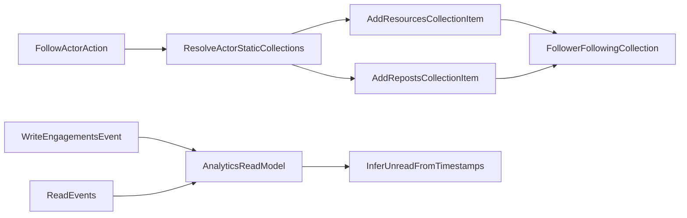

# Data Model Decisions Rollout Plan

## Confirmed Decisions

- Keep **REST** for Milestone 1; acknowledge GraphQL resolver model may fit nested/recursive feeds better later.
- Keep **engagements** as explicit table (canonical event source); collections remain feed/curation views.
- Collection visibility comes from **permissions + `collections.status`**; no `collection_visibility_settings` table.
- `notifications` is **virtual** (query on `engagements`), not a stored collection row.
- Read/unread for notifications/resources belongs to **analytics/usage metrics**; unread is inferred from read-event timestamp vs engagement timestamp.
- Permission static subject id uses `**authenticated`** (meaning “any authenticated user”).
- “Follow actor” uses **flat following**: follower stores actor’s `resources` + `reposts` collections as separate items (optional dropdown for additional static collections).
- “User/workspace union” term for feed owner is `**actor`**.
- `**packages/db` is source of truth** for DB schemas, exported TS types/constants, and canonical entity-level Zod schemas; apps/docs must consume and align to it.

## Implementation Tracks

## 1) Schema-first alignment, then docs rebuild (#38, #51)

- Treat current docs as partially stale relative to schema and in-flight decisions.
- Implement decisions in source-of-truth layers first:
  - DB schema/constants and canonical entity validators in [packages/db/src/schema](/Users/mia/vesta-cx/vesta/packages/db/src/schema) and [packages/db/src/entity-schemas](/Users/mia/vesta-cx/vesta/packages/db/src/entity-schemas)
  - Erato validation/services/routes in [apps/erato/src/services](/Users/mia/vesta-cx/vesta/apps/erato/src/services) and [apps/erato/src/routes](/Users/mia/vesta-cx/vesta/apps/erato/src/routes)
- After implementation, do a **docs rebuild pass from scratch** for db model pages so docs reflect actual schema/service behavior (not incremental patching of old wording).

## 1.1) Enforce source-of-truth boundaries

- `packages/db` owns:
  - Drizzle tables/enums/relations
  - Exported TS types/constants (e.g. subject/object/action enums)
  - Canonical entity-level Zod schemas used across services
- Erato owns route/request-specific shapes only (wrappers/compositions), and should import canonical primitives from `@vesta-cx/db` where applicable.
- Docs in `apps/docs/content/packages/db/`** must describe implemented behavior in `packages/db`, not speculative variants.

## 2) Finalize doc model consistency (#52)

- Normalize all collection item terminology in [collections.md](/Users/mia/vesta-cx/vesta/apps/docs/content/packages/db/model/collections/collections.md):
  - Ensure the schema block and prose match one chosen representation (`item_type` + optional `kind`).
  - Keep `actor` term explicit and documented once.
- Keep semantic distinctions centralized in [model/index.md](/Users/mia/vesta-cx/vesta/apps/docs/content/packages/db/model/index.md):
  - owner vs actor
  - permission vs engagement subject/action/object.
- Ensure permissions docs in [permissions.md](/Users/mia/vesta-cx/vesta/apps/docs/content/packages/db/model/access/permissions.md) and API docs in [api-routes.md](/Users/mia/vesta-cx/vesta/apps/docs/content/apps/erato/api-routes.md) consistently use `static:authenticated` (#45).

## 3) Clean up schema/migration state (#41)

- Remove temporary no-prod migration file and journal entry:
  - [0004_static_subject_authenticated.sql](/Users/mia/vesta-cx/vesta/packages/db/drizzle/0004_static_subject_authenticated.sql)
  - [drizzle meta journal](/Users/mia/vesta-cx/vesta/packages/db/drizzle/meta/_journal.json)
- Keep enum change in schema:
  - [permissions schema](/Users/mia/vesta-cx/vesta/packages/db/src/schema/permissions.ts)
  - [erato validation message](/Users/mia/vesta-cx/vesta/apps/erato/src/services/permissions.ts)

## 4) Define flat-following implementation contract (API + services) (#43, #53)

- Add explicit behavior to API docs + service TODOs:
  - Follow user/workspace inserts **two collection_items** into follower’s `following`: target actor `resources` and `reposts` collections.
  - Optional follow preferences UI maps to which static collections are inserted.
- Touchpoints:
  - [api-routes.md](/Users/mia/vesta-cx/vesta/apps/docs/content/apps/erato/api-routes.md)
  - Erato collections/engagement services and route handlers (under `apps/erato/src/routes` and `apps/erato/src/services`).

## 5) Read/unread analytics contract (#44, #53)

- Keep canonical definition in [usage-metrics-roadmap.md](/Users/mia/vesta-cx/vesta/apps/docs/content/projects/vesta/usage-metrics-roadmap.md):
  - event shape for read actions
  - unread inference rule
  - race-condition safeguards (idempotency key + monotonic “read at” semantics).
- Keep cross-reference in [milestones.md](/Users/mia/vesta-cx/vesta/apps/docs/content/projects/vesta/milestones.md).

## 6) Performance/index follow-up for engagements (#42)

- Convert index TODOs in [engagements.md](/Users/mia/vesta-cx/vesta/apps/docs/content/packages/db/model/collections/engagements.md) into concrete index migrations after reviewing real query paths in Erato.
- Candidate indexes to validate:
  - `(object_type, object_id, action)`
  - `(subject_type, subject_id, action, created_at)`
  - `(subject_type, subject_id, action, object_type, object_id)`

## Rollout Order

1. Implement schema/service decisions first (source of truth).
2. Migration/journal cleanup.
3. Implement flat-following write behavior in Erato services.
4. Add and validate engagement indexes.
5. Rebuild db model docs from scratch from implemented schema/service behavior.

## Data Flow (Target)

## Notes / Risks

- Current docs already include many decisions; risk is drift between schema snippets and current DB schema constants.
- Flat-following reduces recursive-query complexity but increases item count per followed actor; pagination and dedupe rules should be explicit in API responses.
- Read/unread inference must define tie-break behavior for equal timestamps and out-of-order ingestion.

