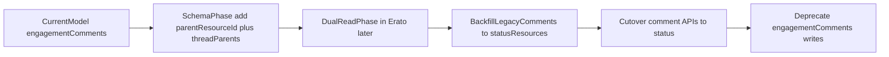

<!-- @format -->

# Status-Based Comments Model Plan

## Goal

Adopt a unified comments/threading model where comments are `status` resources:

- top-level status: no parent
- reply/comment: `parent_resource_id` set

This plan is `packages/db` first. Erato route/service implementation is explicitly deferred.

## Scope (Phase 1: `packages/db` only) (#49, #50)

- Update schema in [packages/db/src/schema/resources.ts](packages/db/src/schema/resources.ts) (add `parent_resource_id`) and add `thread_parents` table schema (same file or a dedicated schema file, then exported via schema index).
- Add migration(s) under [packages/db/drizzle](packages/db/drizzle)
- Add/adjust enum and type docs in [packages/db/src/schema/types.ts](packages/db/src/schema/types.ts) as needed
- Update schema docs in `apps/docs/content/packages/db/model/resources/resource.md` and `apps/docs/content/packages/db/model/collections/engagements.md` (#50)

## Locked Decisions

- Use `status` resources for comments/replies (`type='status'`), no new `comment` resource type.
- Keep only direct parent on `resources` via `parent_resource_id`.
- Use a closure table `thread_parents(resource_id, ancestor_id, depth)` for descendant/ancestor traversal.
- Do not add `root_resource_id` or `thread_depth` columns on `resources`.
- Keep Erato/vesta web write-path implementation out of Phase 1; tracked in #71.

## Proposed Data Model Changes (`packages/db`) (#49)

1. **resources**: Add `parentResourceId` only (nullable self-reference to `resources.id`). No `root_resource_id` or `thread_depth` on the main table.
2. **thread_parents** (new table): Materialize the full ancestor chain per resource so "all descendants of any node" is one query.
   - Columns: `resource_id` (the status/comment), `ancestor_id` (one of its ancestors), `depth` (1 = direct parent, 2 = grandparent, …).
   - Constraints: composite PK `(resource_id, ancestor_id)`; FKs from both columns to `resources.id`.
   - One row per (resource, ancestor). For a new reply, copy the direct parent’s ancestors and add the direct parent; depth = existing depths + 1 for copied rows, and 1 for the direct parent.
   - **Write rule (Erato / vesta web)**: On insert of a status with `parent_resource_id`:
     1. Query `thread_parents` where `resource_id = direct_parent_id` to get all ancestors of the direct parent.
     2. Insert rows for the new resource by copying all parent ancestors with `depth + 1`.
     3. Insert one additional row `(new_resource_id, direct_parent_id, 1)` for the direct parent.
     4. Depth of the new resource can be computed as `COUNT(*)` rows for `resource_id = new_resource_id` (equivalent to `MAX(depth)`).
   - **Reads**: "All comments under resource X" (any depth) → `SELECT resource_id FROM thread_parents WHERE ancestor_id = ?`. Direct replies → `WHERE parent_resource_id = X` on resources.
3. **Indexes**:
   - `resources`: `(parent_resource_id, created_at)` — direct children of a resource, by time.
   - `thread_parents`: `(ancestor_id, depth)` — descendants by node/depth; `(resource_id)` — ancestor fetch for write path.
4. Keep `type = 'status'` as canonical comment/reply type (no new `comment` resource type).

## Validation/Constraint Rules (to encode in app logic later)

- `type='status'` may have `parent_resource_id` or null
- non-status resources typically should not have `parent_resource_id` (enforced in Erato layer, optionally with DB checks where feasible)
- parent must exist and be an allowed type (`post|song|album|status` as finalized later)
- no self-parent, no cycles, optional max depth policy

## Engagement Model Transition

- Treat comment text/comment threads as resource content (status resource payload) over time
- Keep non-comment engagement actions (`like`, `repost`, `bookmark`, etc.) in engagements model
- Mark `engagement_comments` as legacy/deprecated in docs during transition

## Deferred Phase (Phase 2: Erato / vesta web implementation)

- **Comment writes**: Implement the write-time materialization of `thread_parents` when creating a status with a parent (query parent’s ancestors, copy with depth+1, add direct parent at depth 1). Documented in a dedicated GitHub issue for Erato/vesta web.
- Create status-as-comment create/list/get routes
- Introduce thread query APIs (children, subtree via thread_parents, pagination)
- Add backfill/dual-read strategy from `engagement_comments` to status resources
- Remove/deprecate comment write path in engagements routes after parity

## Migration Strategy

## Execution Sequence (Agent-Oriented)

1. **Schema update (`schema-changes`)**
   - Add `resources.parent_resource_id` FK to `resources.id` (nullable).
   - Add `thread_parents` table with PK `(resource_id, ancestor_id)`, FKs to `resources.id`, and `depth` integer.
   - Add indexes: `resources(parent_resource_id, created_at)`, `thread_parents(ancestor_id, depth)`, `thread_parents(resource_id)`.
2. **Migration (`migration-files`)**
   - Generate and verify a Drizzle migration that adds the above column/table/indexes with no destructive changes.
3. **Docs (`documentation`)**
   - Document closure-table behavior, write materialization rule, and descendant/direct-reply query patterns.
   - Mark engagement comments as transition/legacy.
4. **Knowledge capture (`rules-skills`)**
   - Only if a reusable/non-obvious modeling convention emerges during implementation.
5. **Review (`review-close`)**
   - Confirm no Erato API changes are included in Phase 1.
   - Confirm plan stays aligned with deferred write-path issue #71.

## Non-Goals (Phase 1)

- No Erato route/service implementation.
- No vesta-web UI/API wiring.
- No backfill from `engagement_comments`.
- No production rollback/reversible migration requirements.

## Acceptance Criteria

- `packages/db` schema has `parent_resource_id` on resources and `thread_parents` table with indexes
- migrations exist and are safe (no prod; reversibility not required)
- db docs clearly describe status-as-comment model, thread_parents write rule, and transition state
- no Erato API behavior change is included in this first phase
- plan remains consistent with issue #71 for deferred Erato/vesta write-path behavior
