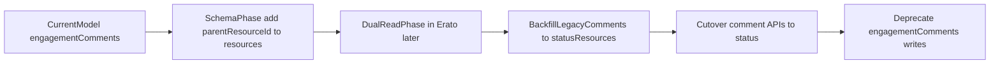

# Status-Based Comments Model Plan

## Goal

Adopt a unified comments/threading model where comments are `status` resources:

- top-level status: no parent
- reply/comment: `parent_resource_id` set

This plan is `**packages/db` first**. Erato route/service implementation is explicitly deferred.

## Scope (Phase 1: `packages/db` only)

- Update schema primitives in `[/Users/mia/vesta-cx/vesta/packages/db/src/schema/resources.ts](/Users/mia/vesta-cx/vesta/packages/db/src/schema/resources.ts)`
- Add/adjust enum and type docs in `[/Users/mia/vesta-cx/vesta/packages/db/src/schema/types.ts](/Users/mia/vesta-cx/vesta/packages/db/src/schema/types.ts)`
- Add migration(s) under `[/Users/mia/vesta-cx/vesta/packages/db/drizzle](/Users/mia/vesta-cx/vesta/packages/db/drizzle)`
- Update schema docs in `[/Users/mia/vesta-cx/vesta/apps/docs/content/packages/db/model/resources/resource.md](/Users/mia/vesta-cx/vesta/apps/docs/content/packages/db/model/resources/resource.md)` and `[/Users/mia/vesta-cx/vesta/apps/docs/content/packages/db/model/collections/engagements.md](/Users/mia/vesta-cx/vesta/apps/docs/content/packages/db/model/collections/engagements.md)`

## Proposed Data Model Changes (`packages/db`)

1. Add `parentResourceId` to `resources` (nullable self-reference to `resources.id`)
2. Add optional thread helper fields for query performance (plan-level decision):
  - `rootResourceId` (nullable self-reference)
  - `threadDepth` (nullable integer)
3. Add indexes for thread reads:
  - `(parent_resource_id, created_at)`
  - `(root_resource_id, created_at)` if `rootResourceId` is adopted
4. Keep `type = 'status'` as canonical comment/reply type (no new `comment` resource type)

## Validation/Constraint Rules (to encode in app logic later)

- `type='status'` may have `parent_resource_id` or null
- non-status resources typically should not have `parent_resource_id` (enforced in Erato layer, optionally with DB checks where feasible)
- parent must exist and be an allowed type (`post|song|album|status` as finalized later)
- no self-parent, no cycles, optional max depth policy

## Engagement Model Transition

- Treat comment text/comment threads as resource content (status resource payload) over time
- Keep non-comment engagement actions (`like`, `repost`, `bookmark`, etc.) in engagements model
- Mark `engagement_comments` as legacy/deprecated in docs during transition

## Deferred Phase (Phase 2: Erato implementation)

- Create status-as-comment create/list/get routes
- Introduce thread query APIs (children, subtree, pagination)
- Add backfill/dual-read strategy from `engagement_comments` to status resources
- Remove/deprecate comment write path in engagements routes after parity

## Migration Strategy

## Acceptance Criteria

- `packages/db` schema supports status threading (`parent_resource_id` baseline)
- migrations exist and are reversible/safe
- db docs clearly describe status-as-comment model and transition state
- no Erato API behavior change is included in this first phase

