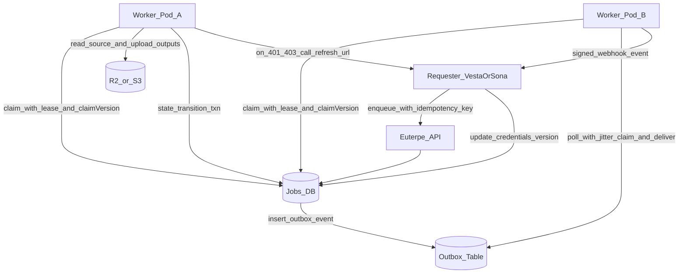

# Euterpe Inbox/Outbox Queue Hardening Plan

## Authoritative implementation spec

- Use [/.cursor/plans/euterpe-implementation-contract.md](/Users/mia/vesta-cx/vesta/.cursor/plans/euterpe-implementation-contract.md) as the source of truth for:
  - state transitions and fencing guarantees
  - API/status code semantics
  - retry/backoff behavior
  - webhook signature contract
  - idempotency behavior
  - credential encryption requirements
  - DB-engine parity and concurrency acceptance criteria
- If any implementation detail in this plan conflicts with the contract doc, the contract doc takes precedence.

## Scope and decisions

- Keep Euterpe in Node/TS; add robust DB-backed queue semantics instead of introducing external queue infra first.
- Use both `worker_id` and `claim_version`:
  - `worker_id` = ownership/auditing/debugging.
  - `claim_version` = stale-write prevention (`WHERE id=? AND claim_version=?`).
- Worker identity comes from env (`POD_NAME` preferred, fallback `HOSTNAME`, then generated UUID on boot).
- Keep one requester callback endpoint (`status_webhook_url`) that accepts both intermediate states and terminal payloads (outputs present only for terminal success).
- Credential refresh is worker-initiated on `401/403` and routed to the original requester (`requested_by`/`refresh_url`).
- Support both DB engines from day one:
  - SQLite/libsql path (portable claim SQL and optimistic updates).
  - Postgres path (`FOR UPDATE SKIP LOCKED`).
- Use the same lease/claim/heartbeat/reclaim pattern for both job processing queue and webhook delivery queue (inbox and outbox).
- Use scoped short-lived storage credentials as the default; signed URLs remain optional.
- Existing API compatibility is not required; redesign endpoints/contracts directly.

## Data model and migration

- Extend/create queue tables in Euterpe DB:
  - `inbox_jobs`: status lifecycle, lease fields, `claim_version`, attempts, retry/backoff, credential/version metadata, webhook metadata, idempotency linkage.
  - `job_outbox_events`: durable callback delivery queue with attempts, lease fields, next-at scheduling.
  - `idempotency_keys`: `(scope, key)` uniqueness + request hash + stored response snapshot + expiry.
- Add indexes for hot paths:
  - claim scanning (`status`, `scheduled_at`, `priority`, `lease_expires_at`)
  - stale lease recovery (`status`, `lease_expires_at`)
  - outbox polling (`status`, `next_attempt_at`)
  - idempotency lookup (`scope`, `key`).

## API contract updates

- `POST /transcode` shifts from file upload-first to job-enqueue contract:
  - accepts source locator (R2/S3 object key or signed read URL), output config, requester metadata, callback/refresh endpoints, idempotency key.
  - returns deterministic response for retries via idempotency table.
  - returns `202 Accepted` on accepted enqueue.
- `GET /transcode/status` returns normalized job state + timestamps + last error + attempt/lease info.
  - return `200 OK` for all successful status reads (recommended; avoid semantic overload of `202`/`201` for polling).
  - return `404` when unknown job id.
  - return `401`/`403` for auth failures.
  - optionally return `410 Gone` for expired/pruned historical jobs.
- Define callback payload versions:
  - intermediate statuses: no outputs.
  - terminal `succeeded`: outputs and metadata.
  - terminal `failed`/`dead_letter`: normalized error payload.

## Worker processing loop

- Implement atomic job claim with lease + fencing:
  - transactional claim of one queued/retryable job.
  - set `worker_id`, `status=claimed`, `lease_expires_at`, `heartbeat_at`, increment `claim_version`.
- State progression:
  - `claimed -> fetching -> processing -> uploading -> succeeded`.
- Heartbeat and lease renewal timer during long operations.
- Retry classification defaults:
  - retryable transport/server errors: `423`, `500`, `502`, `503`, `504`.
  - `429`: retryable with immediate larger backoff bucket.
  - `401`/`403`: trigger credential refresh flow; if refresh fails repeatedly, job retries until job `max_attempts`.
- On deterministic processing failure: `failed` (non-retryable).
- On stale lease: allow other workers to reclaim after expiry.
- Always clean temp files in `finally`.
- Enforce configurable size limits:
  - max source input size.
  - output guardrail: each individual output must not exceed `200%` of source size when source is `>1GB`.

## Credential refresh flow

- On storage auth failure (`401/403`):
  - worker calls requester `refresh_url` with signed request.
  - requester updates credential payload/version in DB-facing API.
  - worker re-reads job and resumes only if `credential_version` advanced.
- No dedicated refresh status is required; refresh is in-band retry behavior.
- Enforce refresh attempt ceiling; if exhausted, classify attempt as failed and continue normal job retry path until job `max_attempts`, then `dead_letter`.

## Outbox callback delivery

- Write outbox events in same transaction as job state transitions to avoid lost notifications.
- All workers run low-frequency jittered outbox pollers using lease claim semantics (`FOR UPDATE SKIP LOCKED`-style behavior where supported).
- Deliver signed webhook events (HMAC + timestamp + nonce), idempotent `event_id`, retries with exponential backoff.
- Move undeliverable events to outbox dead-letter and alert.
- Outbox defaults:
  - poll interval: 500ms-1500ms jittered.
  - claim batch size default: 10; max configurable up to 25 for low-CPU pods (`~400m`) unless profiling supports more.
  - per-worker concurrent webhook sends default: 5.

## Security and signing

- Prefer short-lived scoped creds or signed object URLs per job; never long-lived broad credentials.
- Sign outbound callbacks and refresh calls; verify on requester side.
- Store only necessary credential metadata; redact sensitive fields from logs.
- Webhook signing contract:
  - headers: `x-euterpe-signature`, `x-euterpe-timestamp`, `x-euterpe-nonce`, `x-euterpe-event-id`.
  - signature input: `timestamp + "." + nonce + "." + raw_body`.
  - algorithm: HMAC-SHA256 with per-requester shared secret.
  - requester verification: enforce timestamp skew window (default +/-5m), nonce replay cache window (>=5m), and constant-time compare.
- Encryption recommendation:
  - implement encryption at rest for persisted scoped credentials (defense in depth for backups/snapshots/insider risk), even if app and DB run in same cluster.
  - use envelope encryption:
    - Data Encryption Key (DEK) per job-credential blob.
    - Key Encryption Key (KEK) from environment/KMS (v1 env-managed, v2 KMS-managed).
    - persist `encrypted_blob`, `dek_wrapped`, `kek_id`, `encryption_version`.
  - bind ciphertext to job context via AAD (`job_id`, `requester_id`, `credential_version`) to prevent copy/paste replay across rows.
  - decrypt only in worker memory at execution time; never log plaintext; zero references after use and cleanup temp artifacts.
  - support key rotation:
    - new writes use active `kek_id`.
    - reads support prior `kek_id`s during migration window.
    - optional background rewrap for old records.
  - fallback policy: if decrypt fails, classify as retryable infra error up to threshold, then `dead_letter` with redacted reason.

## Credential encryption implementation notes

- Minimal v1 storage model for creds attached to `inbox_jobs`:
  - `storage_creds_encrypted` (blob/text)
  - `storage_creds_dek_wrapped` (blob/text)
  - `storage_creds_kek_id` (string)
  - `storage_creds_encryption_version` (int)
- Encryption boundaries:
  - encrypt only sensitive credential material.
  - keep non-sensitive routing metadata in plaintext columns (`bucket`, `region`, `object_key`, `output_prefix`) for queryability.
- Refresh flow writes a new encrypted credential blob and increments `credential_version`.
- Add a feature flag to allow emergency disable of encrypted credential persistence only in non-production environments.

## Observability and operations

- Metrics: queue depth, oldest queued age, claim latency, success/failure rates, refresh rate, callback retry depth, dead-letter counts.
- Structured logs include `job_id`, `worker_id`, `claim_version`, `event_id`.
- Requester-side reconciler cron is optional, not required for protocol correctness.
  - If implemented later, it should identify stale jobs and request safe refresh/requeue (same `job_id`) rather than creating duplicate jobs.

## Planned file touchpoints

- Existing and likely new Euterpe files (create/update as needed during implementation):
  - [apps/euterpe/src/db/schema.ts](/Users/mia/vesta-cx/vesta/apps/euterpe/src/db/schema.ts)
  - [apps/euterpe/src/routes/transcode.ts](/Users/mia/vesta-cx/vesta/apps/euterpe/src/routes/transcode.ts)
  - [apps/euterpe/src/routes/transcode-status.ts](/Users/mia/vesta-cx/vesta/apps/euterpe/src/routes/transcode-status.ts)
  - [apps/euterpe/src/workers/job-runner.ts](/Users/mia/vesta-cx/vesta/apps/euterpe/src/workers/job-runner.ts)
  - [apps/euterpe/src/workers/outbox-runner.ts](/Users/mia/vesta-cx/vesta/apps/euterpe/src/workers/outbox-runner.ts)
  - [apps/euterpe/src/services/idempotency.ts](/Users/mia/vesta-cx/vesta/apps/euterpe/src/services/idempotency.ts)
  - [apps/euterpe/src/services/credential-refresh.ts](/Users/mia/vesta-cx/vesta/apps/euterpe/src/services/credential-refresh.ts)
  - [apps/euterpe/src/services/webhook-signing.ts](/Users/mia/vesta-cx/vesta/apps/euterpe/src/services/webhook-signing.ts)
  - [apps/euterpe/drizzle/*](/Users/mia/vesta-cx/vesta/apps/euterpe/drizzle)
  - [apps/euterpe/README.md](/Users/mia/vesta-cx/vesta/apps/euterpe/README.md)

## Execution phases

1. Finalize engine-specific claim/reclaim SQL (SQLite/libsql + Postgres) and shared transition/retry matrix.
2. Schema + migration + indexes (`inbox_jobs`, `job_outbox_events`, `idempotency_keys`).
3. Claim/lease/fencing worker loop + status machine + size guardrails.
4. Idempotent enqueue + status route normalization (`POST /transcode` = `202`, status reads = `200`).
5. Credential refresh flow and version checks.
6. Outbox writer + distributed dispatcher + webhook signing.
7. Concurrency test suite against both DB engines in CI.
8. Credential encryption implementation + rotation support.
9. Tests, docs, and rollout toggles/metrics.

