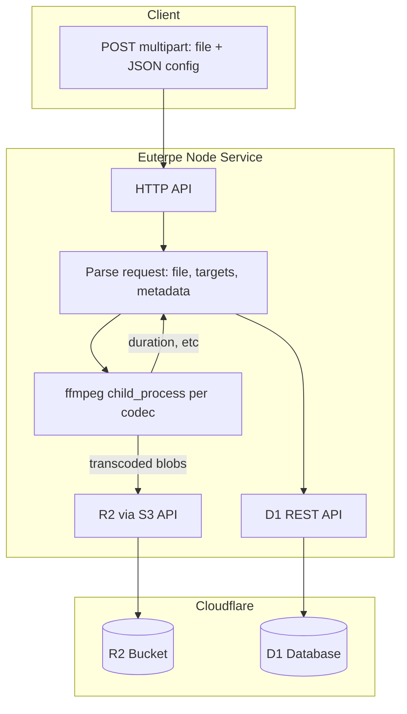

# Euterpe Transcoding Microservice Plan

## Architecture




## Key Design Decisions

1. **Runtime**: Node.js (or Bun) — long-running HTTP server, ffmpeg via `child_process.spawn`
2. **R2 access**: `@aws-sdk/client-s3` with R2 S3-compatible endpoint (requires R2 API tokens)
3. **D1 access**: Cloudflare D1 REST API or Hyperdrive (if available); alternatively, share schema with quality-survey and use a D1 HTTP proxy Worker
4. **Schema**: Euterpe will write to the same `source_files` + `candidate_files` tables as quality-survey; output filenames follow `{basename}_{codec}_{bitrate}.{ext}`
5. **API keys**: All requests require a valid API key; reject 401 if missing or invalid. Prevents unauthorized use of transcoding on your hardware.

## API Key Authentication

- **Header**: `Authorization: Bearer <api_key>` or `X-API-Key: <api_key>`
- **Validation**: On every request to protected routes, check that the key matches a configured value. Optional: reject keys not starting with `eut_` (helps catch wrong-key mistakes). Use `crypto.timingSafeEqual()` for constant-time comparison.
- **Storage**: (1) Env `EUTERPE_API_KEY` or `EUTERPE_API_KEYS`. (2) Local file `.euterpe-api-keys`. Auth: valid if (in env or file) AND not in `.euterpe-revoked-keys`. Revoked list only for env-only keys. Add both key files to `.gitignore`.
- **QS Worker**: Store the key in `PRIVATE_EUTERPE_API_KEY` (or similar) in quality-survey `.dev.vars` / secrets. QS includes it when POSTing to euterpe.
- **401 response**: `{ "error": "Unauthorized" }` when key is missing or invalid.
- **Key prefix**: `eut_` (e.g. `eut_a1b2c3d4...`) — identifies euterpe keys; avoids confusion with WorkOS `sk_`, GitHub `gh_pat_`, etc.
- **Key generation**: CLI `pnpm run gen-key` — generates `eut_` + base64url random, prints, appends to `.euterpe-api-keys`.
- **Revocation**: CLI `pnpm run revoke-key <key>` — If key is in `.euterpe-api-keys`, remove it. Else (env-only key), add to `.euterpe-revoked-keys` since we can't delete from env. Revoked list only for keys we can't remove at source.

## Request/Response Contract

**POST /transcode** (multipart/form-data)


| Field    | Type        | Description                    |
| -------- | ----------- | ------------------------------ |
| `file`   | File        | Source audio (FLAC, WAV, etc.) |
| `config` | JSON string | See below                      |


**Config JSON:**

```json
{
  "targets": [{ "codec": "flac", "bitrate": 0 }, { "codec": "opus", "bitrate": 128 }, ...],
  "metadata": {
    "title": "...",
    "artist": "...",
    "licenseUrl": "...",
    "genre": "...",
    "streamUrl": "..."
  },
  "r2Bucket": "vesta-quality-survey-audio",
  "d1DatabaseId": "<uuid>"
}
```

**Response:** `201` with created `sourceFile` and `candidates` (IDs, R2 keys). Or `202` + job ID if we add async/queue later.

## Implementation Plan

### 1. Scaffold euterpe app

- Create `apps/euterpe/` structure:
  - `package.json` — Node/Bun, deps: `@aws-sdk/client-s3`, `drizzle-orm`, `express` or `hono` (or native `http`)
  - `tsconfig.json` — strict TypeScript
  - `src/index.ts` — HTTP server entry
- Add to `pnpm-workspace.yaml` and `turbo.json` if not already covered

### 2. Transcoding module

- **File**: [apps/euterpe/src/transcode.ts](apps/euterpe/src/transcode.ts)
- Use `child_process.spawn('ffmpeg', [...])` per codec; write to temp files or in-memory streams
- Reuse ffmpeg flags from [tools/scripts/audio/generate-permutations.sh](tools/scripts/audio/generate-permutations.sh) and [.cursor/rules/ffmpeg-audio-encoding.mdc](.cursor/rules/ffmpeg-audio-encoding.mdc):
  - FLAC: `-c:a flac`
  - Opus: `-c:a libopus -b:a {k}k`, extension `.ogg`
  - MP3: `-c:a libmp3lame -b:a {k}k -id3v2_version 3`
  - AAC: `-c:a aac -b:a {k}k -movflags +faststart`
- Apply metadata: `-map_metadata 0 -metadata title="..." -metadata artist="..."`
- Extract duration via `ffprobe` (or parse ffmpeg stderr) for DB

### 3. R2 upload module

- **File**: [apps/euterpe/src/storage/r2.ts](apps/euterpe/src/storage/r2.ts)
- Use `@aws-sdk/client-s3` with R2 endpoint:
  - `https://<ACCOUNT_ID>.r2.cloudflarestorage.com`
- Env vars: `R2_ACCOUNT_ID`, `R2_ACCESS_KEY_ID`, `R2_SECRET_ACCESS_KEY`
- Key structure: `sources/{sourceId}/{basename}_{codec}_{bitrate}.{ext}` and `candidates/{sourceId}/{basename}_{codec}_{bitrate}.{ext}` — aligned with quality-survey

### 4. D1 write module

- **File**: [apps/euterpe/src/db/d1-http.ts](apps/euterpe/src/db/d1-http.ts)
- Use [D1 HTTP API](https://developers.cloudflare.com/d1/api/) to run SQL:
  - `POST /accounts/{account_id}/d1/database/{database_id}/query`
  - Env: `CLOUDFLARE_ACCOUNT_ID`, `CLOUDFLARE_API_TOKEN`, `D1_DATABASE_ID`
- SQL: `INSERT INTO source_files (...) VALUES (...)` and `INSERT INTO candidate_files (...)`
- Reuse schema types from quality-survey (extract to `packages/utils` or copy minimal types)

**Alternative**: If D1 REST is cumbersome, add a thin Worker in quality-survey that exposes a `POST /api/euterpe/insert` accepting JSON and executing D1 inserts. Euterpe would `fetch()` that endpoint.

### 5. API route handler

- **File**: [apps/euterpe/src/routes/transcode.ts](apps/euterpe/src/routes/transcode.ts)
- Parse multipart: `file` + `config`
- Validate: codecs in `['flac','opus','mp3','aac']`, metadata required (title, licenseUrl)
- Generate `sourceId` (UUID), `basename` from filename
- Call transcode → upload each output to R2 → insert source + candidates into D1
- Return 201 with created IDs and keys

### 6. API key scripts

- **generate-api-key.ts**: Generates `eut_` + base64url random, prints, appends to `.euterpe-api-keys`.
- **revoke-key.ts**: If key in `.euterpe-api-keys`, remove it. Else add to `.euterpe-revoked-keys` (env-only keys we can't delete).
- Auth: valid if (in env or file) AND not in revoked.
- `.gitignore`: `.euterpe-api-keys`, `.euterpe-revoked-keys`

### 7. API key middleware

- **File**: [apps/euterpe/src/middleware/auth.ts](apps/euterpe/src/middleware/auth.ts)
- Extract key from `Authorization: Bearer ...` or `X-API-Key`
- Load valid keys: env + `.euterpe-api-keys`. Load revoked: `.euterpe-revoked-keys`. Reject if revoked, else validate with constant-time comparison.
- Use `crypto.timingSafeEqual()` for comparison
- Apply before route handlers

### 8. Config and env

- **File**: [apps/euterpe/.env.example](apps/euterpe/.env.example)
- Document: `EUTERPE_API_KEY` or `EUTERPE_API_KEYS`, `R2_*`, `CLOUDFLARE_*`, `D1_DATABASE_ID`, `PORT`
- Optional: `config` in request can override bucket/DB for multi-tenant

### 9. Quality-survey integration (optional, later)

- Add optional "Upload raw FLAC → transcode via euterpe" flow in admin/sources
- quality-survey would `fetch(EUTERPE_URL + '/transcode', { method: 'POST', body: formData, headers: { 'Authorization': 'Bearer ' + env.PRIVATE_EUTERPE_API_KEY } })`
- Store `PRIVATE_EUTERPE_API_KEY` in QS secrets

## File Layout

```
apps/euterpe/
├── package.json
├── tsconfig.json
├── .env.example
├── .euterpe-api-keys         # valid keys, gitignored
├── .euterpe-revoked-keys     # revoked env-only keys, gitignored
├── scripts/
│   ├── generate-api-key.ts
│   └── revoke-key.ts
├── src/
│   ├── index.ts          # HTTP server
│   ├── transcode.ts      # ffmpeg spawn + metadata
│   ├── middleware/
│   │   └── auth.ts       # API key validation
│   ├── storage/
│   │   └── r2.ts         # S3 client for R2
│   ├── db/
│   │   └── d1-http.ts    # D1 REST or proxy
│   └── routes/
│       └── transcode.ts  # POST /transcode handler
```

## Schema Alignment

Euterpe must produce DB rows compatible with quality-survey:

- `source_files`: `id`, `basename`, `r2Key`, `uploadedAt`, `licenseUrl`, `title`, `artist`, `genre`, `streamUrl`, `duration`
- `candidate_files`: `id`, `r2Key`, `codec`, `bitrate`, `sourceFileId`

R2 keys: `sources/{sourceId}/{basename}_flac_0.flac`, `candidates/{sourceId}/{basename}_opus_128.ogg`, etc.

## Open Questions

1. **D1 from outside Workers**: Prefer D1 REST API directly, or a small proxy Worker in quality-survey?
2. **Async jobs**: For large files, return 202 + job ID and process in background? (v1 can stay synchronous)

