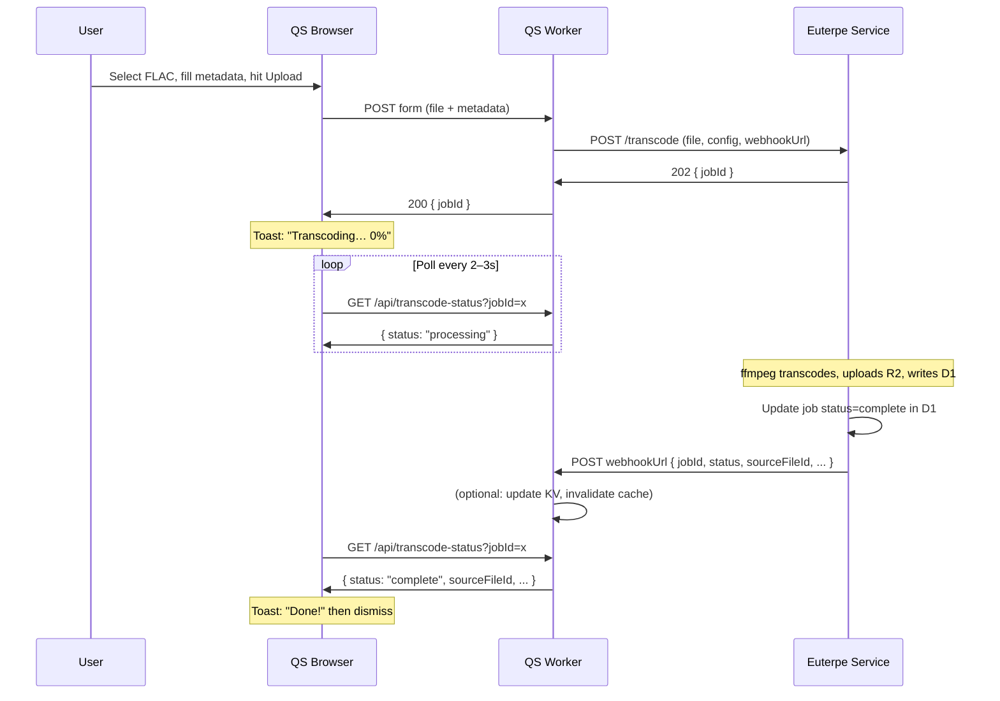

# Euterpe Transcoding Microservice (Updated)

## Client = Quality-Survey Worker

The **client** in the flow is the quality-survey SvelteKit app running as a Cloudflare Worker. When an admin user:

1. Opens the sources admin page
2. Selects a FLAC file and fills metadata (title, artist, license URL, etc.)
3. Hits "Upload"

…the QS Worker receives the form, then POSTs the file + config to euterpe (with `Authorization: Bearer <api_key>`). Euterpe validates the API key and returns immediately (202 Accepted) with a job ID. QS returns that to the client. The client shows "Transcoding…" in the upload-progress toast and polls for completion. When euterpe finishes, it calls a webhook URL provided by QS so the next poll (or a refresh) finds the job complete.

## Async Flow with Webhook




**Webhook role:** Euterpe calls the webhook when done so QS can react (e.g. invalidate caches, trigger notifications). The client learns about completion via polling D1 — the job status is written by euterpe. If QS and euterpe share the same D1, the webhook is optional for the "client knows when done" path, but useful for server-side side effects and decoupling (e.g. if job table lives elsewhere).

## API Key Authentication

- **Header**: `Authorization: Bearer <api_key>` or `X-API-Key: <api_key>`
- **Validation**: Reject if key is in `.euterpe-revoked-keys`. Else, valid if in (env or file). Use `crypto.timingSafeEqual()`. Optional: reject keys not starting with `eut_`.
- **Storage**: (1) Env `EUTERPE_API_KEY` or `EUTERPE_API_KEYS` (comma-separated). (2) Local file (default `.euterpe-api-keys`, or `EUTERPE_KEYS_FILE`), one key per line. Auth validates against union of both. Enables multiple tokens without huge env strings.
- **QS Worker**: Stores key in `PRIVATE_EUTERPE_API_KEY`; includes it when POSTing to euterpe.
- **401**: `{ "error": "Unauthorized" }` when key is missing or invalid.
- **Key prefix**: `eut_` (e.g. `eut_a1b2c3d4...`) — identifies euterpe keys, avoids confusion with other services (WorkOS `sk_`, GitHub `gh_pat_`, etc.).
- **Key generation**: CLI `pnpm run gen-key` — generates `eut_` + base64url random, prints to stdout, and appends to `.euterpe-api-keys`. Creates file if missing. Add to `.gitignore`.
- **Revocation**: CLI `pnpm run revoke-key <key>` — (1) If key is in `.euterpe-api-keys`, remove it. (2) If key is not in the file (env-only, e.g. QS Worker secrets), add to `.euterpe-revoked-keys` since we can't delete from env. No growing revoked list for file keys — just delete. Revoked list only for keys we can't remove at source.

## Request Contract (Updated)

**POST /transcode** (multipart/form-data, requires API key)


| Field    | Type        | Description                    |
| -------- | ----------- | ------------------------------ |
| `file`   | File        | Source audio (FLAC, WAV, etc.) |
| `config` | JSON string | See below                      |


**Config JSON:**

```json
{
  "targets": [{ "codec": "flac", "bitrate": 0 }, { "codec": "opus", "bitrate": 128 }],
  "metadata": { "title": "...", "artist": "...", "licenseUrl": "...", "genre": "...", "streamUrl": "..." },
  "webhookUrl": "https://quality-survey.example.com/api/webhooks/euterpe-complete",
  "r2Bucket": "vesta-quality-survey-audio",
  "d1DatabaseId": "<uuid>"
}
```

**Response: 202 Accepted**

```json
{ "jobId": "uuid", "status": "processing" }
```

**Webhook payload** (euterpe → QS when done):

```json
{
  "jobId": "uuid",
  "status": "complete",
  "sourceFileId": "uuid",
  "candidateIds": ["uuid", "uuid"],
  "error": null
}
```

On failure: `status: "failed"`, `error: "message"`.

## QS Admin Integration

1. **New upload mode:** "Upload raw FLAC" (alternative to pre-transcoded directory).
2. **Form:** File input (single FLAC) + metadata fields. Submit → QS Worker streams/buffers file, POSTs to euterpe with `webhookUrl` = `new URL('/api/webhooks/euterpe-complete', request.url).href` (or derived from env).
3. **Toast:** Extend upload-progress store:
  - `uploading` (0–100): uploading to euterpe
  - `transcoding` (jobId): euterpe accepted, show "Transcoding…" + poll
  - `complete`: job done, show "Done!" then dismiss
4. **Polling:** `GET /api/transcode-status?jobId=x` queries `transcode_jobs` in D1. Euterpe writes to that table when complete.
5. **Webhook handler:** `POST /api/webhooks/euterpe-complete` — verify payload (optional: HMAC), update any QS-specific state. Main completion state is already in D1.

## Schema Addition

**transcode_jobs** (in quality-survey D1, used by both):


| Column         | Type    | Description                           |
| -------------- | ------- | ------------------------------------- |
| id             | text PK | jobId (UUID)                          |
| status         | text    | pending, processing, complete, failed |
| source_file_id | text    | FK when complete                      |
| error          | text    | when failed                           |
| created_at     | integer | timestamp                             |
| updated_at     | integer | timestamp                             |


Euterpe creates the row (status=pending) before returning 202, updates to complete/failed when done. QS polls this table.

## Stack & Deployment

- **Framework**: Hono (not Express) — preferred patterns, lightweight.
- **Runtime**: Node.js; ffmpeg via `child_process` (must be installed in container).
- **Container**: Docker image with Node + ffmpeg. For K8s, keys typically come from Secrets (env) rather than local files.
- **K8s**: Deployment, Service, ConfigMap, Secret. Deploy to home cluster. In-cluster: use env from Secret for API keys; key files are for local/dev.
- **Stateless**: No persistent in-process state. Job status in D1; temp files cleaned per request. Safe to run multiple replicas behind a load balancer.

## Storage Abstraction

Storage is abstracted in sona ([apps/sona/src/lib/server/storage/](apps/sona/src/lib/server/storage/)):

- **Interface**: `StorageProvider` with `put`, `get`, `delete`, `list`, `getSignedUrl`
- **Current impl**: `R2StorageProvider` (Workers `R2Bucket` binding)
- **Target**: Uploadthing — automatic tiering between high/low frequency data (S3/R2) for cost optimization; uses its own API, not S3-compatible. So we need the abstraction.

Planned providers:

1. **R2StorageProvider** (Workers) — sona today
2. **R2S3StorageProvider** (Node, S3 API) — euterpe
3. **UploadthingStorageProvider** — future; replaces or runs alongside R2 for cost-optimized tiering

Extract interface + types to `packages/storage`. Sona and euterpe use it. Euterpe instantiates `R2S3StorageProvider` for now.

## File Layout

```
apps/euterpe/
├── package.json
├── tsconfig.json
├── .env.example
├── Dockerfile
├── k8s/
│   ├── deployment.yaml
│   ├── service.yaml
│   ├── configmap.yaml
│   └── secret.yaml.example
├── .euterpe-api-keys         # valid keys, one per line, gitignored
├── .euterpe-revoked-keys     # revoked env-only keys (can't delete at source), gitignored
├── scripts/
│   ├── generate-api-key.ts   # pnpm run gen-key
│   └── revoke-key.ts         # pnpm run revoke-key <key>
├── src/
│   ├── index.ts
│   ├── transcode.ts
│   ├── middleware/auth.ts   # API key validation
│   ├── storage/
│   │   └── index.ts   # factory: R2S3StorageProvider from @vesta-cx/storage
│   ├── db/d1-http.ts
│   └── routes/transcode.ts
```

