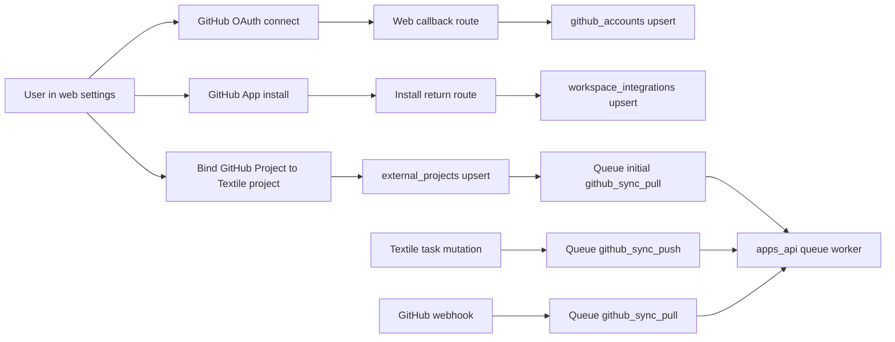

<!-- @format -->

# GitHub Projects MVP

## Scope

- Ship a web-first GitHub Projects integration for Textile.
- Include the small shared-UI cleanup: replace `Notifications` with `Back to site` in the user switcher.
- Do not add desktop-specific GitHub settings/auth UI in this pass; desktop can consume the same backend state later.

## Current Reality

- Useful backend primitives already exist in [`apps/api/src/lib/github/auth.ts`](/Users/mia/mia-cx/textile-thesis/apps/api/src/lib/github/auth.ts), [`apps/api/src/lib/github/graphql.ts`](/Users/mia/mia-cx/textile-thesis/apps/api/src/lib/github/graphql.ts), and the queue handlers in [`apps/api/src/index.ts`](/Users/mia/mia-cx/textile-thesis/apps/api/src/index.ts).
- The data model already has integration tables in [`packages/db/src/schema/integrations.ts`](/Users/mia/mia-cx/textile-thesis/packages/db/src/schema/integrations.ts).
- The missing piece is the end-to-end app flow: no browser-facing GitHub connect/install/bind UX, no writes into the integration tables, no encrypted token usage, and no producer that enqueues GitHub push sync from task changes.

## Architecture Direction

- Keep the long-running, webhook, and sync-worker responsibilities in `apps/api`.
- Use the authenticated web app for browser-facing GitHub connection and settings because the WorkOS cookie session and workspace context already live there.
- Factor any GitHub helpers that must be shared by both apps out of `apps/api` into a shared internal module only if reuse becomes necessary during implementation; do not duplicate OAuth or token logic in two places.

## Implementation Plan

### 1. Finish the shared settings shell and menu cleanup

- Replace the placeholder item in [`packages/ui/src/lib/components/ui/app-sidebar/nav-user.svelte`](/Users/mia/mia-cx/textile-thesis/packages/ui/src/lib/components/ui/app-sidebar/nav-user.svelte) with `Back to site` and wire it to the public-site/app boundary.
- Extend the settings surface in [`apps/web/src/lib/stores/settings.svelte.ts`](/Users/mia/mia-cx/textile-thesis/apps/web/src/lib/stores/settings.svelte.ts), [`apps/web/src/lib/components/settings-shell.svelte`](/Users/mia/mia-cx/textile-thesis/apps/web/src/lib/components/settings-shell.svelte), and [`apps/web/src/lib/components/settings/workspace-settings.svelte`](/Users/mia/mia-cx/textile-thesis/apps/web/src/lib/components/settings/workspace-settings.svelte) with a real GitHub integration section/tab.
- The workspace settings UI should show GitHub account connection status, GitHub App installation status for the current workspace, linked GitHub Project, sync status, manual sync controls, and disconnect/unlink actions.

### 2. Secure token handling and integration persistence

- Stop storing raw GitHub OAuth tokens in `github_accounts.encrypted*` columns. Use [`packages/auth/src/crypto.ts`](/Users/mia/mia-cx/textile-thesis/packages/auth/src/crypto.ts) for encryption/decryption and introduce the env contract needed for the encryption key.
- Audit the integration writes that are currently missing and add explicit upsert paths for:
  - `github_accounts`
  - `workspace_integrations`
  - `external_projects`
  - any runtime link needed so synced issue-backed items surface correctly in the existing project UI
- Fix the pull-sync actor gap so imported tasks do not rely on `createdByUserId: 'system'`; use a real workspace/user-backed strategy that satisfies the schema and audit trail.

### 3. Build the browser-facing GitHub connect/install flow

- Add authenticated web routes for:
  - starting GitHub OAuth
  - handling GitHub OAuth callback
  - starting GitHub App install from the current workspace settings
  - handling the GitHub App install return and attaching the installation to the active workspace
- Reuse the existing GitHub app/OAuth primitives from [`apps/api/src/lib/github/auth.ts`](/Users/mia/mia-cx/textile-thesis/apps/api/src/lib/github/auth.ts), extracting them to a shared location only if the web worker must call them directly.
- Persist the connected GitHub user identity and installation metadata immediately on callback/return, then redirect back into the settings modal/workspace settings state.

### 4. Add GitHub Project binding and initial import

- In workspace settings, let the user choose a Textile project and bind it to a GitHub Project.
- Save that binding in `external_projects`, including remote project id/url and enabled sync state.
- Trigger an initial `github_sync_pull` once binding is saved so the local Textile project is hydrated from GitHub immediately.
- Normalize core field mapping at bind time so status/priority/iteration/date semantics are explicit rather than guessed later.

### 5. Complete bidirectional sync wiring

- Keep queue execution in [`apps/api/src/index.ts`](/Users/mia/mia-cx/textile-thesis/apps/api/src/index.ts), but close the known gaps:
  - produce `github_sync_push` when Textile task mutations occur in bound projects
  - push title/body/status/priority/iteration/planned-date/due-date changes, not just field-only partial updates
  - support create/update/delete/reopen flows consistently for GitHub Project items
  - make webhook-driven pull sync safe and idempotent
  - fix status normalization so GitHub values map to Textile statuses the UI already expects
- Ensure the UI-facing GitHub issue/embed card reads from the same runtime linkage the sync engine writes, instead of leaving `external_items` and current issue-link rendering disconnected.

### 6. Validation and acceptance

- Verify these end-to-end paths before calling the implementation done:
  - connect GitHub account from settings
  - install the GitHub App for a workspace/org and return to Textile successfully
  - bind a Textile project to a GitHub Project
  - import existing GitHub Project items into Textile
  - create/update/delete Textile tasks and observe queued push sync
  - edit GitHub Project items and observe webhook/manual pull sync back into Textile
  - confirm stored GitHub tokens are encrypted at rest
- Treat the plan as incomplete unless all of the above work from the web app without manual DB patching.

## Key Files

- Browser settings/UI: [`apps/web/src/lib/components/settings/workspace-settings.svelte`](/Users/mia/mia-cx/textile-thesis/apps/web/src/lib/components/settings/workspace-settings.svelte), [`apps/web/src/lib/components/settings-shell.svelte`](/Users/mia/mia-cx/textile-thesis/apps/web/src/lib/components/settings-shell.svelte), [`apps/web/src/routes/app/+layout.svelte`](/Users/mia/mia-cx/textile-thesis/apps/web/src/routes/app/+layout.svelte)
- API auth/sync core: [`apps/api/src/lib/github/auth.ts`](/Users/mia/mia-cx/textile-thesis/apps/api/src/lib/github/auth.ts), [`apps/api/src/lib/github/graphql.ts`](/Users/mia/mia-cx/textile-thesis/apps/api/src/lib/github/graphql.ts), [`apps/api/src/index.ts`](/Users/mia/mia-cx/textile-thesis/apps/api/src/index.ts), [`apps/api/src/routes/app.ts`](/Users/mia/mia-cx/textile-thesis/apps/api/src/routes/app.ts)
- Data contracts: [`packages/db/src/schema/integrations.ts`](/Users/mia/mia-cx/textile-thesis/packages/db/src/schema/integrations.ts), [`packages/db/src/schema/tasks.ts`](/Users/mia/mia-cx/textile-thesis/packages/db/src/schema/tasks.ts), [`packages/auth/src/crypto.ts`](/Users/mia/mia-cx/textile-thesis/packages/auth/src/crypto.ts)

## Non-goals

- No desktop-specific GitHub UI/auth parity in this pass.
- No notification system work.
- No attempt to declare the old `textile_full_implementation` plan accurate for GitHub end-to-end behavior; this plan explicitly replaces that assumption for the GitHub integration slice.
