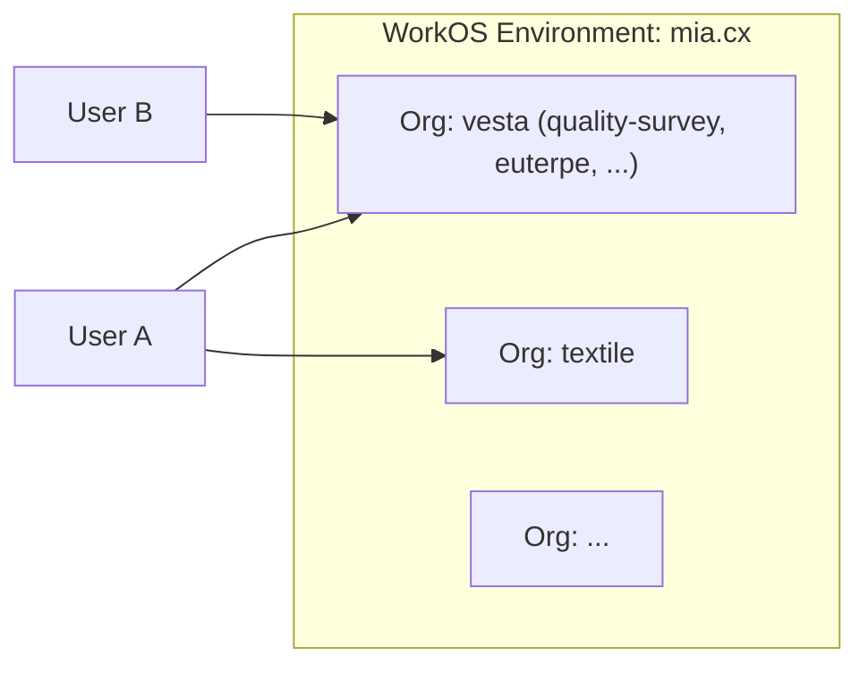
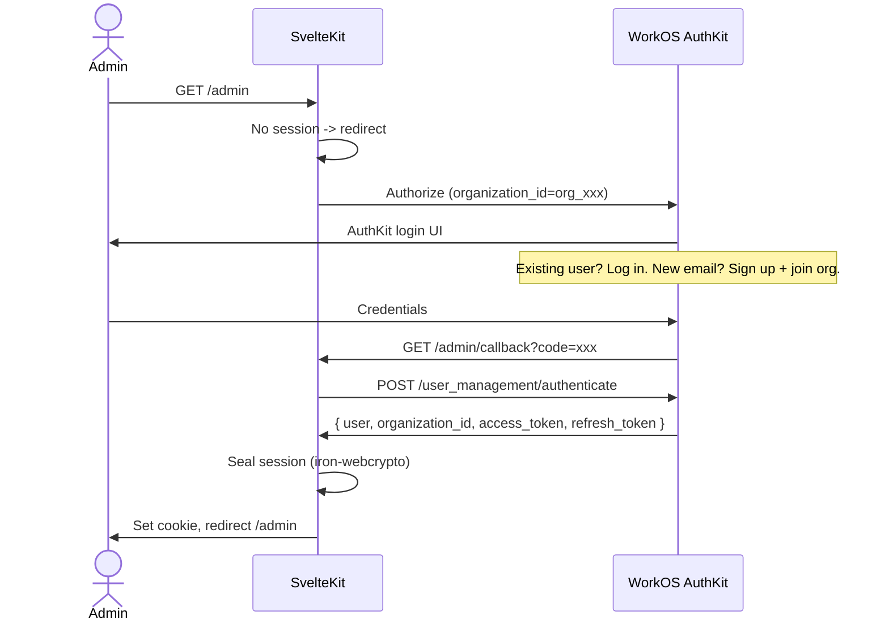

# WorkOS AuthKit Setup for quality-survey

## Architecture Context

Single WorkOS environment (mia.cx) with **one Organization per project group**. Users have one account across all apps. The quality-survey app shares the **"vesta" org** with other vesta-cx apps. For now, only admins authenticate; the architecture should stay extensible for future respondent auth.




## Current State

The app has a scaffolded WorkOS integration at [src/lib/server/auth/index.ts](apps/quality-survey/src/lib/server/auth/index.ts) with login/callback/session management, but:

- Uses **wrong API** — SSO endpoints (`/sso/authorize`, `/sso/token`) instead of User Management
- **No organization scoping** — doesn't pass `organization_id` in the authorize URL
- **Unencrypted sessions** — base64-encoded cookies (code has a TODO comment about this)
- **No logout route**

## Auth Flow (Target)




## 1. WorkOS Dashboard Configuration

- Verify the **vesta Organization** exists and note its `org_id`
- Under **AuthKit > Authentication**, enable desired methods (email+password, social)
- Under **AuthKit > Redirects**, add:
  - Dev: `http://localhost:5173/admin/callback`
  - Prod: `https://<prod-domain>/admin/callback`
- Grab **Client ID** and **API Key** from the dashboard (API Keys page)

## 2. Environment Variables

Update [.dev.vars.example](apps/quality-survey/.dev.vars.example):

```
PRIVATE_WORKOS_CLIENT_ID=client_...
PRIVATE_WORKOS_API_KEY=sk_test_...
PRIVATE_WORKOS_ORG_ID=org_...
PRIVATE_WORKOS_COOKIE_PASSWORD=<32+ chars, generate with: openssl rand -base64 24>
```

Add `PRIVATE_WORKOS_ORG_ID` and `PRIVATE_WORKOS_COOKIE_PASSWORD` to the `Platform.env` interface in [src/app.d.ts](apps/quality-survey/src/app.d.ts).

## 3. Rewrite Auth Module

Rewrite [src/lib/server/auth/index.ts](apps/quality-survey/src/lib/server/auth/index.ts):

`**getAuthorizationUrl()**` — switch to User Management authorize endpoint:

- URL: `https://api.workos.com/user_management/authorize`
- Params: `client_id`, `redirect_uri`, `response_type: 'code'`, `provider: 'authkit'`, `organization_id`, `state` (CSRF)

`**authenticateWithCode()**` — switch to User Management authenticate:

- URL: `POST https://api.workos.com/user_management/authenticate`
- Body: `{ client_id, client_secret (api_key), grant_type: 'authorization_code', code }`
- Response: `{ user: { id, email, first_name, last_name, ... }, organization_id, access_token, refresh_token }`

**Session data** — store richer payload:

```typescript
interface AdminSession {
  userId: string;
  email: string;
  organizationId: string;
  firstName?: string;
  lastName?: string;
  accessToken: string;   // for future WorkOS API calls
  refreshToken: string;  // for token refresh
}
```

`**createSession()` / `getSession()**` — use `iron-webcrypto` `seal()` / `unseal()` instead of base64.

## 4. Encrypted Sessions (iron-webcrypto)

- Install: `pnpm --filter quality-survey add -D iron-webcrypto`
- `seal(crypto, session, password, defaults)` to encrypt into cookie value
- `unseal(crypto, sealed, password, defaults)` to decrypt
- Use `globalThis.crypto` (available on Workers) as the crypto implementation
- Cookie stays httpOnly, secure, sameSite=lax

## 5. Update Callback Route

Update [src/routes/(app)/admin/callback/+page.server.ts](apps/quality-survey/src/routes/(app)/admin/callback/+page.server.ts):

- Parse the new response shape (`user` not `profile`)
- Store `access_token`, `refresh_token`, `organization_id` in the session
- Validate `state` param matches what was set in the login redirect (CSRF)

## 6. Add Logout Route

New file: `src/routes/(app)/admin/logout/+page.server.ts`

- Clear the session cookie
- Redirect to `/admin/login`
- (Optional future: call WorkOS session logout endpoint)

## 7. Test the Flow

1. `pnpm --filter quality-survey dev`
2. `/admin` -> redirect to `/admin/login` -> redirect to WorkOS AuthKit (scoped to vesta org)
3. Sign in (or sign up if new) -> callback -> encrypted session cookie set -> `/admin`
4. `/admin/logout` -> cookie cleared -> `/admin/login`

## Files Changed

- `src/lib/server/auth/index.ts` — Full rewrite: User Management API, org scoping, iron-webcrypto
- `src/app.d.ts` — Add `PRIVATE_WORKOS_ORG_ID`, `PRIVATE_WORKOS_COOKIE_PASSWORD`
- `.dev.vars.example` — Add org ID and cookie password
- `src/routes/(app)/admin/callback/+page.server.ts` — New response shape, CSRF validation
- `src/routes/(app)/admin/login/+page.server.ts` — Pass org ID to authorize URL
- `src/routes/(app)/admin/logout/+page.server.ts` — New file
- `src/routes/(app)/admin/+layout.server.ts` — Expose richer session data

## Standing Items

- **Tests**: Unit tests for `seal`/`unseal` session helpers, authorize URL builder, authenticate response parsing
- **Rules & skills**: Create rule for "WorkOS on Cloudflare Workers" pattern (no SDK, REST API, iron-webcrypto, org-scoped auth)
- **Documentation**: Update README with WorkOS setup instructions, env var list, org architecture
- **Review & close**: E2E login flow, verify encrypted cookies in devtools, check for edge cases (expired session, invalid state, org mismatch)

